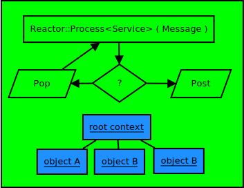

## Real-time cloud architecture with thread affinity.

Recently I worked on cloud-native CPP application where we developed real-time services. These services are running on distributed nodes and highly scalable. 

Let us discuss my work by dividing it into topics on these keywords.

### Cloud-native service

These services are running in cloud servers(VMs) and communicating with each other. 

#### Communication

Talking about communication, there are open-standards for 3GPP, SIP and WebRTC. That being said, we can develop a persistent service that has **ability to change** on,

- open standard like ASN.1.
- gRPC/proto that generates file in different languages.
- Thrift

If we thinking **deeply**, the way we allow things change or make them **soft** is making each of these members in messages **optional**.

With that, I would caution that I do not love the gRPC generated C code . I think modern C++ 17 has better ability , we can even do C++ ORM(object-relational-mapping) now a days.

### Real-time nature

We can allow thousands of **contexts** (think go-context) in CPP in some array/map or under some kind of context-tree. We can also use ORM to write them in memory or SQLite/DB for persistence.

Now to process these context work-flow, in CPP we have **state-machines** that process incoming messages and send/post messages to other services.

We call these event-loops, because in one end we are receiving messages for-ever in a loop. Note that other than this message-queue synchronizations, these workers are totally independent of each other.

How is it realtime?

- It is realtime because these workers do not wait for each-other.
    - That means whenever there is message in *message-queue*, it handles them immediately.
- There is no *context-switch* between workers because a group of workers reside in same thread.
- And a single thread has affinity to same processor, so the it is **cache coherent**.
- The real-IO using TCP/IP are non-blocking.

Let us see these green-thread layout.

This layout gives us good vertical scalablity as the number of thread increases.

### How is it better than go-routinge.

TODO
